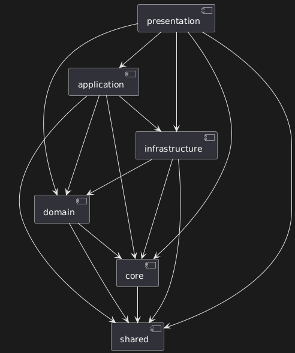

# Brand API

Este es un proyecto de API para gestionar marcas, desarrollado con FastAPI.



## Cómo Levantar el Proyecto Localmente

Sigue estos pasos para configurar y ejecutar el proyecto en tu entorno local.

### Pre-requisitos

Asegúrate de tener instalados los siguientes programas:

- Python 3.10 o superior
- Poetry para la gestión de dependencias de Python
- Docker y Docker Compose para los servicios de base de datos y caché

### 1. Clonar el Repositorio

```bash
git clone https://github.com/vant3x/brand-registration-fastapi-react.git
cd brand-api
```

### 2. Configurar Variables de Entorno

Copia el archivo de ejemplo `.env.example` para crear tu propio archivo de configuración local `.env`.

```bash
cp .env.example .env
```

El archivo `.env` ya viene pre-configurado para apuntar a la base de datos de Docker. Siéntete libre de ajustar otras configuraciones si es necesario.

### 3. Instalar Dependencias

Usa Poetry para instalar todas las dependencias del proyecto definidas en `pyproject.toml`.

```bash
poetry install
```

### 4. Levantar Servicios con Docker

Para levantar la base de datos PostgreSQL y el servidor de Redis, utiliza el archivo `docker-compose.yml` que se encuentra en la carpeta `docker`.

```bash
docker-compose -f docker/docker-compose.yml up -d
```

### 5. Aplicar Migraciones de la Base de Datos

Una vez que la base de datos esté corriendo, aplica las migraciones para crear las tablas necesarias.

```bash
poetry run alembic upgrade head
```

### 6. Ejecutar la Aplicación

Puedes iniciar el servidor de desarrollo usando el script `start.sh`. Este script utiliza `uvicorn` para correr la aplicación FastAPI con recarga automática.

```bash
./scripts/start.sh
```

La API estará disponible en `http://localhost:8000`.

## Endpoints de la API

La documentación interactiva de la API (Swagger UI) está disponible en `http://localhost:8000/docs`.

### Autenticación (`/auth`)

- `POST /token`: Obtiene un token de acceso y de refresco.
- `POST /refresh`: Refresca un token de acceso expirado.

### Usuarios (`/users`)

- `POST /`: Crea un nuevo usuario.
- `GET /me`: Obtiene los datos del usuario autenticado.
- `GET /{user_id}`: Obtiene un usuario por su ID.
- `GET /`: Obtiene una lista de todos los usuarios.
- `PUT /{user_id}`: Actualiza los datos de un usuario.
- `DELETE /{user_id}`: Elimina un usuario.

### Marcas (`/brands`)

- `POST /`: Crea una nueva marca (requiere autenticación).
- `PUT /{brand_id}/image`: Sube una imagen para una marca (requiere autenticación).
- `GET /{brand_id}/image/presigned-url`: Obtiene una URL pre-firmada para ver la imagen de una marca (requiere autenticación).
- `GET /{brand_id}`: Obtiene una marca por su ID (requiere autenticación).
- `GET /`: Obtiene una lista de todas las marcas.
- `PUT /{brand_id}`: Actualiza los datos de una marca (requiere autenticación).
- `DELETE /{brand_id}`: Elimina una marca (requiere autenticación).
